# **Identificação**

* **Título do Projeto:** Frota360
* **Linha de Projeto (Direction):** Web
* **Autor:** Paulo Henrique Scialla Vom Scheidt
* **Data da Proposta:** 15/06/2026
* **Versão:** 2.0 — revisão de 13/11/2026

### Histórico de revisões

| Versão | Data | O que mudou |
| :---- | :---- | :---- |
| 1.0 | 15/06/2026 | Proposta inicial: CRUD de veículos, motoristas e rotas, cadastro aberto, SQL Server e Redis. |
| 2.0 | 13/11/2026 | Documento alinhado ao sistema construído: multi-tenant por empresa, quatro papéis, entrada por convite, manutenção preventiva, abastecimento, despesas, custos, auditoria, integração com Google Maps Platform e Resend, PostgreSQL e deploy em EC2. As mudanças e seus motivos estão na seção 2.7. |

# **RFC – Frota360: Sistema de Gestão de Frotas**

## **1. Visão do Produto e Impacto**

---

## **1.1 Contexto e Problema**

O controle operacional de frotas veiculares em ambientes industriais e logísticos ainda é, em muitos casos, realizado de forma manual, descentralizada ou com ferramentas pouco integradas.

### **Quem sofre com o problema**

* Empresas de logística
* Indústrias com frota própria
* Transportadoras de pequeno e médio porte
* Gestores de frota e manutenção

### **Contexto em que ocorre**

O problema ocorre principalmente em cenários onde há:

* Múltiplos veículos operando simultaneamente
* Diversos motoristas compartilhando veículos
* Necessidade de controle de manutenção preventiva
* Registro histórico de rotas, quilometragem e gastos

### **Como o problema é resolvido atualmente**

* Planilhas (Excel/Google Sheets)
* Controle manual (papel ou formulários)

### **Limitações das soluções atuais**

* Falta de integração entre dados de uso, manutenção e custo
* Dificuldade de rastrear o histórico completo por veículo
* Ausência de alertas de manutenção
* Dependência de input manual sujeito a erro humano
* Baixa capacidade analítica (KPIs limitados)

### **Exemplo real de fluxo atual**

1. Motorista registra o KM manualmente ao sair e ao retornar
2. Gestor consolida os dados em planilha
3. Controle de manutenção e de combustível é feito separadamente
4. Não há visão consolidada de:
   * Rotas realizadas
   * Uso por motorista
   * Desgaste e custo do veículo

---

## **1.2 Origem da Demanda e Evidências**

### **Demanda Externa**

* **Organização:** Opa Bier Joinville
* **Contexto:** Empresa enfrentando dificuldades no controle de manutenção e uso da frota
* **Problema relatado:**
  * Perda de controle sobre revisões
  * Falta de histórico confiável
  * Dificuldade em identificar uso indevido dos veículos

---

### **Pesquisa com Usuários**

* **Número de entrevistados:** 1 (gestor da fábrica Opa Bier Joinville), com retornos ao longo do desenvolvimento

#### **Principais dores identificadas**

| Dor |
| :---- |
| Falta de histórico confiável |
| Esquecimento de manutenção |
| Dificuldade de rastrear uso por motorista |
| Dependência de planilhas |
| Gasto com combustível sem medida de consumo (km/l, R$/l) |

#### **Padrões observados**

* Uso intensivo de Excel
* Ausência de automação
* Controle reativo (não preventivo)

---

### **Evidência de Interesse**

* Feedback comum:
  * "Seria ideal ter alertas automáticos de manutenção"
  * "Não sabemos exatamente quem usou qual veículo"
  * "Perdemos muito tempo organizando dados"

A revisão do apontamento de abastecimento (seção 2.7) partiu do mesmo interlocutor: sem litros e odômetro, km/l e R$/l eram impossíveis de apurar, e é justamente o que a gestão quer medir.

---

## **1.3 Análise de Soluções Existentes (Benchmark)**

### **1. Samsara**

* **Link:** [https://www.samsara.com](https://www.samsara.com)
* **Público-alvo:** Empresas de grande porte
* **Funcionalidades:** rastreamento GPS em tempo real, telemetria, monitoramento de motoristas
* **Limitações:** alto custo, dependência de hardware (IoT)

### **2. Fleetio**

* **Link:** [https://www.fleetio.com](https://www.fleetio.com)
* **Público-alvo:** Pequenas e médias empresas
* **Funcionalidades:** controle de manutenção, histórico de veículos, gestão de combustível
* **Limitações:** interface complexa, foco mais administrativo que operacional

### **3. Geotab**

* **Link:** [https://www.geotab.com](https://www.geotab.com)
* **Público-alvo:** Grandes frotas
* **Funcionalidades:** telemetria avançada, análise de desempenho
* **Limitações:** necessidade de instalação de dispositivos, alto custo inicial

### **4. Traccar**

* **Link:** [https://www.traccar.org](https://www.traccar.org)
* **Público-alvo:** Desenvolvedores / soluções customizadas
* **Funcionalidades:** rastreamento GPS, código aberto
* **Limitações:** baixa usabilidade, não cobre gestão completa (manutenção, custo, histórico)

### **Comparação**

| Solução | Pontos Fortes | Limitações |
| ----- | ----- | ----- |
| Samsara | Completo, robusto | Alto custo |
| Fleetio | Gestão administrativa | UX complexa |
| Geotab | Telemetria avançada | Dependência de hardware |
| Traccar | Código aberto | Baixa usabilidade |

### **Diferencial do Projeto**

* Foco em simplicidade e usabilidade
* Sem dependência de hardware: a quilometragem vem do odômetro informado em rotas, abastecimentos e manutenções
* Integração, num só lugar, entre:
  * Histórico de rotas e controle de KM
  * Manutenção preventiva por quilometragem e data
  * Abastecimento, despesas e custo por quilômetro
  * Uso por motorista
* Um sistema para várias empresas (multi-tenant), com dados isolados por empresa
* Direcionado a pequenas e médias empresas (baixo custo)

---

## **1.4 Público-Alvo**

### **Perfil do usuário**

* Gestores de frota
* Supervisores logísticos e operadores de pátio
* Motoristas
* Pequenas transportadoras e indústrias com frota própria

### **Contexto de uso**

* Ambiente corporativo, uso diário para controle operacional
* Acesso via navegador web: a gestão no computador, o motorista no celular

### **Nível técnico**

* Básico a intermediário — usuários não técnicos

---

## **1.5 Objetivos do Projeto**

### **Objetivo Geral**

Desenvolver um sistema web capaz de centralizar o gerenciamento de rotas, uso, manutenção e custo de veículos, reduzindo erros operacionais e melhorando a tomada de decisão.

### **Objetivos Específicos**

* Controlar o histórico de rotas por veículo e por motorista
* Calcular e armazenar a quilometragem percorrida a partir do odômetro
* Manter o odômetro do veículo atualizado pelos fluxos do dia a dia (rota, abastecimento, manutenção)
* Sinalizar manutenções preventivas atrasadas ou próximas do vencimento
* Registrar abastecimentos e despesas e consolidar o custo da frota (R$/km, km/l)
* Controlar o acesso por papel e registrar quem alterou o quê
* Disponibilizar um dashboard com os indicadores operacionais

---

## **1.6 Métricas de Sucesso (KPIs)**

* Redução de 30% no tempo de controle manual
* Registro de 100% das rotas realizadas
* Precisão de ≥ 95% nos dados de quilometragem
* Suporte inicial a até 50 usuários simultâneos

# **2. Engenharia de Requisitos**

Esta seção define o que o sistema faz.

---

## **2.1 Personas**

Cada persona corresponde a um papel do sistema (RN01):

| Persona | Papel no sistema |
| :---- | :---- |
| Carlos Mendes, gestor de frota | Supervisor |
| Ana Paula Souza, administradora do sistema | Admin |
| Roberto Lima, motorista | Motorista |

O quarto papel, **Operador**, é o de quem opera o pátio: visualiza a frota, abre, edita e encerra rotas e lança abastecimentos e despesas, sem cadastrar veículos nem catálogos.

### **Persona 1 — Carlos Mendes, Gestor de Frota**

**Contexto:** Carlos tem 42 anos e trabalha como gestor de logística em uma empresa de médio porte com uma frota de 30 veículos. Controla tudo em planilhas Excel e sofre com informações desatualizadas e falta de visibilidade sobre veículos, motoristas e gastos.

**Objetivos:**

* Ter visibilidade do status dos veículos e rotas
* Reduzir custos operacionais com melhor controle de quilometragem e consumo
* Saber rapidamente qual motorista está com qual veículo
* Não deixar revisão vencer

**Principais dificuldades:**

* Perda de tempo consolidando informações de diferentes fontes
* Dificuldade em identificar veículos disponíveis para novas rotas
* Falta de histórico organizado de rotas, motoristas e gastos

---

### **Persona 2 — Ana Paula Souza, Administradora do Sistema**

**Contexto:** Ana tem 35 anos, é analista administrativa e é responsável por manter os dados do sistema e as pessoas que têm acesso a ele. Não tem conhecimento técnico avançado, mas utiliza sistemas web no dia a dia.

**Objetivos:**

* Dar e retirar acesso às pessoas certas, com o papel certo
* Cadastrar e atualizar veículos e catálogos de forma simples
* Saber quem alterou um registro, e quando

**Principais dificuldades:**

* Sistemas complexos com muitos passos para operações simples
* Falta de validação de dados que gera erros de cadastro
* Dificuldade em localizar registros específicos rapidamente

---

### **Persona 3 — Roberto Lima, Motorista**

**Contexto:** Roberto tem 38 anos e é motorista profissional há 12 anos. Usa o sistema para abrir e encerrar as próprias rotas e lançar abastecimentos. Acessa principalmente pelo celular.

**Objetivos:**

* Abrir a rota ao sair e encerrá-la ao chegar, informando o odômetro
* Lançar o abastecimento na estrada
* Saber o estado do veículo que vai usar (manutenção em dia ou atrasada)

**Principais dificuldades:**

* Sistemas que não funcionam bem no celular
* Processos burocráticos que tomam tempo antes de iniciar uma viagem
* Falta de clareza sobre qual veículo está designado para ele

---

## **2.2 Casos de Uso Principais**

### **UC01 — Acesso e sessão**

* Entrar com e-mail e senha
* Manter a sessão ativa (renovação automática) e sair
* Recuperar a senha por e-mail

### **UC02 — Empresa e pessoas**

* Provisionar uma empresa nova (backoffice, venda assistida)
* Convidar uma pessoa por e-mail, com papel definido
* Aceitar o convite e criar a própria conta
* Alterar o papel de um usuário, ativá-lo ou desativá-lo
* Consultar e corrigir o próprio cadastro (perfil)

### **UC03 — Gestão de veículos**

* Cadastrar, listar, atualizar e remover veículos
* Ver se o veículo está em rota ou disponível

### **UC04 — Rotas**

* Abrir uma rota associando motorista, veículo e odômetro inicial
* Calcular o trajeto (distância, duração e mapa)
* Encerrar a rota com o odômetro final
* Corrigir ou remover uma rota (gestão)
* Motorista: abrir, acompanhar e encerrar as próprias rotas

### **UC05 — Manutenção preventiva**

* Manter o catálogo de tipos de manutenção
* Agendar manutenção por quilometragem e/ou data
* Concluir a manutenção com custo
* Acompanhar manutenções atrasadas e vencendo

### **UC06 — Abastecimento e despesas**

* Lançar abastecimento (combustível, posto, litros, R$/l, odômetro, nota fiscal)
* Manter os catálogos de combustíveis e postos
* Lançar despesas avulsas (pedágio, multa, IPVA, seguro)
* Manter o catálogo de tipos de despesa

### **UC07 — Indicadores e auditoria**

* Acompanhar o dashboard da frota
* Consultar o custo consolidado por veículo, motorista, origem e período
* Consultar a trilha de auditoria

---

## **2.3 Requisitos Funcionais (RF)**

### **Acesso e sessão**

**RF01** — O sistema deve permitir login com e-mail e senha, abrindo uma sessão autenticada.
**RF02** — O sistema deve renovar a sessão automaticamente enquanto o refresh token for válido e permitir que o usuário saia, revogando-o.
**RF03** — O sistema deve permitir a redefinição de senha por link enviado ao e-mail, sem revelar se o e-mail está cadastrado.
**RF04** — O sistema deve exigir senha com no mínimo 6 caracteres, uma letra maiúscula e um número.
**RF05** — O sistema deve rejeitar acessos não autenticados (401) e ações fora do papel do usuário (403).

### **Empresa e pessoas**

**RF06** — O sistema deve permitir provisionar uma empresa por um endpoint de backoffice protegido por chave, semeando os catálogos padrão e emitindo o convite do primeiro Admin.
**RF07** — O Admin deve poder convidar pessoas por e-mail, definindo o papel (Admin, Supervisor, Operador ou Motorista), e cancelar convites pendentes.
**RF08** — O convidado deve poder consultar o convite (empresa, e-mail e papel) e aceitá-lo informando nome e senha, e opcionalmente CPF e data de nascimento; o aceite já abre a sessão.
**RF09** — O Admin deve poder listar os usuários da empresa, alterar o papel e ativar ou desativar cada um.
**RF10** — Todo usuário autenticado deve poder consultar e corrigir o próprio nome, CPF e data de nascimento.

### **Veículos**

**RF11** — O sistema deve permitir cadastrar veículo informando nome, marca, placa e quilometragem.
**RF12** — O sistema deve permitir listar, atualizar e remover veículos da empresa.
**RF13** — A listagem de veículos deve indicar se cada veículo está em rota ou disponível.

### **Motoristas**

**RF14** — O sistema deve listar os motoristas da empresa, que são os usuários com o papel Motorista.

### **Rotas**

**RF15** — O sistema deve permitir abrir uma rota associando motorista, veículo, odômetro inicial e endereços de partida e chegada.
**RF16** — O sistema deve calcular, a pedido, a distância, a duração estimada e o traçado do trajeto, exibindo-o em mapa.
**RF17** — O sistema deve permitir encerrar a rota informando o odômetro final e, opcionalmente, a data de fim.
**RF18** — A gestão deve poder listar, filtrar, corrigir e remover rotas.
**RF19** — O motorista deve poder abrir, consultar e encerrar somente as próprias rotas.

### **Manutenção**

**RF20** — O sistema deve manter um catálogo de tipos de manutenção por empresa, com intervalo de quilometragem opcional.
**RF21** — O sistema deve permitir agendar manutenção para um veículo, com quilometragem prevista e data prevista opcional.
**RF22** — O sistema deve permitir concluir a manutenção informando quilometragem, data e custo.
**RF23** — O sistema deve sinalizar as manutenções atrasadas e as que vencem nos próximos 500 km.
**RF24** — O motorista deve poder consultar as manutenções dos veículos, sem ver o custo.

### **Abastecimento e despesas**

**RF25** — O sistema deve permitir lançar abastecimento com veículo, motorista, combustível, posto, litros, valor por litro, odômetro, nota fiscal e frentista (opcional), calculando o valor total.
**RF26** — O sistema deve manter os catálogos de tipos de combustível e de postos credenciados.
**RF27** — O sistema deve estimar o consumo (km/l) a partir dos abastecimentos do veículo.
**RF28** — O sistema deve permitir lançar despesas avulsas por veículo (pedágio, multa, IPVA, seguro etc.), com motorista opcional, e manter o catálogo de tipos de despesa.

### **Indicadores e auditoria**

**RF29** — O sistema deve consolidar os custos de abastecimento, manutenção e despesa, com filtros por veículo, motorista, origem e período, e calcular R$/km e km/l por veículo e por mês.
**RF30** — O sistema deve exibir um dashboard com frota em rota, custo e quilometragem do mês, manutenções que precisam de atenção, rotas em andamento e evolução de custo dos últimos 6 meses.
**RF31** — O sistema deve registrar em trilha de auditoria toda operação de escrita, com autor, data, IP e alterações.
**RF32** — O Admin deve poder consultar a trilha de auditoria filtrando por entidade, ação, usuário e período.

### **Transversais**

**RF33** — As listagens que crescem com o tempo (rotas, manutenções, abastecimentos, despesas, custos e auditoria) devem ser paginadas no servidor, com totais calculados sobre o filtro inteiro.
**RF34** — O sistema deve ter uma página pública de apresentação do produto.

---

## **2.4 Requisitos Não Funcionais (RNF)**

### **Desempenho**

**RNF01** — O tempo de resposta das requisições deve ser inferior a 500 ms em condições normais de uso.
**RNF02** — O sistema deve suportar pelo menos 50 usuários simultâneos na versão inicial.

> RNF01 e RNF02 são metas: só passam a ser medidas quando o monitoramento estiver no ar (seção 7).

### **Segurança**

**RNF03** — A autenticação usa JWT com validade de 1 hora e refresh token de 7 dias, rotacionado a cada uso. Os dois trafegam apenas em cookies `HttpOnly`, `Secure` e `SameSite=None`, nunca no corpo da resposta nem no armazenamento do navegador.
**RNF04** — Senhas são armazenadas com hash BCrypt; tokens de convite, redefinição de senha e refresh são armazenados apenas como hash.
**RNF05** — Somente login, renovação de sessão, recuperação e redefinição de senha, consulta e aceite de convite e os health checks são anônimos; o backoffice exige chave própria; todo o resto exige sessão válida.
**RNF06** — A chave de assinatura do JWT deve ter no mínimo 32 caracteres e vir de configuração externa (user-secrets ou variável de ambiente); sem ela a aplicação não inicia.
**RNF07** — As rotas de autenticação têm limite de 5 requisições por minuto por IP, e a API inteira, de 200 por minuto por IP.
**RNF08** — Os dados de uma empresa nunca são visíveis a outra: a empresa vem sempre do token, nunca da requisição.

### **Disponibilidade**

**RNF09** — A API deve ter disponibilidade mínima de 99% em horário comercial, com health checks em `/health` e `/health/detail`.

### **Implantação e portabilidade**

**RNF10** — A aplicação deve ser containerizada via Docker, e a stack de produção deve poder ser ensaiada localmente com a mesma configuração.

### **Usabilidade**

**RNF11** — A API segue os padrões REST, com os verbos HTTP corretos, e transições de estado em endpoints próprios (`/encerrar`, `/concluir`).
**RNF12** — As respostas usam um envelope único (`sucesso`, `mensagem`, `dados`, `erros`); erros de validação indicam campo e mensagem, e erros de regra de negócio trazem texto para o usuário final.
**RNF13** — A API tem documentação interativa via Scalar em ambiente de desenvolvimento.
**RNF14** — A interface é inteiramente em português e deve funcionar em navegador de computador e de celular.

> RNF14 está parcialmente atendido: as telas funcionam no celular, mas usam o mesmo layout do painel, com barra lateral. Um layout dedicado ao motorista é o próximo passo (seção 2.6).

### **Manutenibilidade e qualidade**

**RNF15** — O código segue Clean Architecture em quatro camadas, CQRS e os princípios SOLID.
**RNF16** — Dados sensíveis (connection strings, chaves de API, chave do JWT) não são versionados.
**RNF17** — A cobertura de testes deve ser de no mínimo 75% de linhas no backend e 50% no frontend; o CI reprova abaixo disso.
**RNF18** — O código passa por análise estática no SonarCloud, com quality gate em todo PR.
**RNF19** — A aplicação emite logs estruturados (Serilog) e deve ser monitorada por ferramenta externa, com alerta de indisponibilidade.

### **Privacidade**

**RNF20** — A trilha de auditoria tem retenção declarada de 12 meses. Os logs da aplicação têm volume limitado: em produção, até 5 arquivos de 10 MB por container; em desenvolvimento, 7 dias.

---

## **2.5 Regras de Negócio**

As regras RN01 a RN11 mantêm a numeração da v1, porque o código e os testes as citam pelo número.

**RN01** — Todo acesso exige sessão válida, e o que cada pessoa pode fazer depende do papel: **Admin** faz tudo e é o único que administra usuários, convites e auditoria; **Supervisor** cadastra, edita e exclui veículos, rotas, manutenções, lançamentos e catálogos; **Operador** visualiza a frota, opera rotas e lança abastecimentos e despesas; **Motorista** opera as próprias rotas e abastecimentos e consulta veículos e manutenções.
**RN02** — Não é permitido cadastrar dois veículos com a mesma placa na mesma empresa (422). A placa pode se repetir entre empresas diferentes.
**RN03** — Não é permitido cadastrar dois usuários com o mesmo CPF na mesma empresa. O CPF é opcional, e vários usuários sem CPF não colidem.
**RN04** — Não é permitido cadastrar dois usuários com o mesmo e-mail em todo o sistema, independentemente de caixa (maiúsculas/minúsculas).
**RN05** — A quilometragem de um veículo não pode ser negativa.
**RN06** — A data de fim de uma rota não pode ser anterior à data de início.
**RN07** — Uma rota deve referenciar um motorista e um veículo existentes **na mesma empresa**; id de outra empresa é tratado como inexistente.
**RN08** — Não é permitido excluir veículo que tenha rota, abastecimento ou despesa associados (422). Usuário nunca é excluído, apenas desativado, para preservar o histórico. Item de catálogo em uso não é excluído: deve ser inativado.
**RN09** — A placa deve seguir o formato Mercosul (ABC1D23) ou o antigo (ABC1234), sem distinção de caixa, e é gravada em maiúsculas.
**RN10** — Ao encerrar uma rota, o sistema calcula a quilometragem percorrida pela diferença de odômetro e atualiza o veículo (odômetro, último motorista e data da última viagem).
**RN11** — Motorista com rota aberta só pode lançar abastecimento no veículo dessa rota; o abastecimento é vinculado à rota automaticamente.
**RN12** — O odômetro do veículo só avança. Abertura e encerramento de rota, conclusão de manutenção e lançamento de abastecimento o atualizam apenas quando o valor informado é maior; nenhuma exclusão o retrocede. O odômetro inicial de uma rota não pode ser menor que o atual do veículo.
**RN13** — O valor do abastecimento é sempre calculado pelo servidor (litros × valor por litro, arredondado em duas casas); o cliente não o informa.
**RN14** — Uma manutenção pendente vence no que vier primeiro, quilometragem ou data prevista. "Atrasada" e "vencendo" (até 500 km do previsto) são calculados na leitura, a partir do odômetro atual. Não é permitido agendar duas manutenções pendentes iguais (mesmo veículo, tipo e quilometragem).
**RN15** — A empresa nunca pode ficar sem um Admin ativo. Alterar o papel ou desativar um usuário encerra a sessão dele.
**RN16** — O motorista só enxerga as próprias rotas e os abastecimentos lançados para ele, inclusive os que a gestão lançou em seu nome; registro de outro motorista responde como inexistente (404).
**RN17** — Item de catálogo inativo (tipo de manutenção, despesa, combustível ou posto) continua nomeando o histórico, mas não recebe lançamento novo.
**RN18** — A trilha de auditoria é somente inclusão: não há alteração nem exclusão de registros, nem pelo Admin.
**RN19** — Distância e duração de trajeto informadas pelo cliente são recusadas quando a velocidade média implícita fica fora de 5–180 km/h.
**RN20** — Convite vale por 7 dias e pode ser usado uma única vez; emitir um novo convite para o mesmo e-mail invalida os pendentes.

---

## **2.6 Fora do Escopo**

Os itens abaixo **não fazem parte da versão 1.0 de produção**:

* **Rastreamento via IoT:** sem integração com GPS ou telemetria em tempo real. A quilometragem vem do odômetro informado.
* **Notificações por e-mail ou push:** os alertas de manutenção são visuais (dashboard e listagem). O e-mail é usado apenas para convite e recuperação de senha.
* **Exportação de relatórios e BI:** a análise de custos acontece na tela; não há exportação para planilha ou PDF.
* **Integração com ERPs, pedágio ou plataformas de logística.**
* **Aplicativo móvel nativo e layout móvel dedicado:** o motorista usa a versão web no celular.
* **Contratação e cobrança online:** a empresa é provisionada pela equipe (venda assistida), pelo backoffice.
* **Purga automática da trilha de auditoria:** a retenção de 12 meses está declarada, mas a rotina de expurgo ainda não existe.
* **Operação fora do fuso de Brasília:** todas as datas são gravadas e exibidas em hora local de Brasília.

---

## **2.7 Evolução do Escopo desde a v1**

O escopo mudou ao longo do desenvolvimento, a partir do retorno do parceiro e das necessidades que o próprio uso revelou. Cada mudança abaixo tem o motivo registrado.

| Na v1 | Hoje | Por quê |
| :---- | :---- | :---- |
| Cadastro aberto ("Registrar nova conta") | Entrada só por convite do Admin; empresa provisionada pelo backoffice | Num sistema com várias empresas, cadastro aberto não diria a que empresa a conta pertence. O convite já leva a empresa e o papel |
| Sem noção de empresa | Multi-tenant: dados isolados por empresa, que vem do token | Atender mais de uma empresa com uma instância só, sem vazamento entre elas |
| Motorista como entidade com CRUD próprio | Motorista é um usuário com o papel Motorista | O motorista precisa entrar no sistema para abrir e encerrar a própria rota; dois cadastros da mesma pessoa divergiriam |
| Permissão por perfil fora do escopo | Quatro papéis (Admin, Supervisor, Operador, Motorista) | Sem papéis, o motorista enxergaria e alteraria os dados da frota inteira |
| Auditoria fora do escopo | Trilha somente-inclusão de toda escrita | Com várias pessoas alterando os mesmos registros, "quem mudou isto?" virou pergunta frequente |
| Alertas de manutenção em versões futuras | Manutenção preventiva com atrasada/vencendo no dashboard | Era a dor número um do parceiro ("esquecimento de manutenção") |
| Gestão financeira fora do escopo | Abastecimento fiscal, manutenção com custo, despesas avulsas e custo consolidado | O parceiro pediu km/l e R$/l; com o combustível dentro, faltava pouco para o custo por km |
| Painel com contadores e rotas recentes | Dashboard de triagem com KPIs, alertas e evolução de custo | Os dados novos (custo, manutenção) passaram a responder "o que precisa de atenção hoje" |
| Rota com origem e destino em texto | Endereços com autocomplete, distância, duração e mapa (Google Maps Platform) | Endereço digitado à mão gerava registros inconsistentes |
| Encerramento da rota pelo PUT | Encerrar é uma ação própria, que calcula o km e avança o odômetro | Pelo PUT dava para "encerrar" sem calcular km nem atualizar o veículo |
| SQL Server, tabelas criadas no SSMS | PostgreSQL 17 com migrations do EF Core aplicadas no boot | Custo, imagem leve e execução em ARM; migrations versionam o schema junto com o código |
| Redis como cache | Sem cache | O volume não justifica a peça a mais; a consulta direta atende o RNF01 |
| JWT de 8 horas no cabeçalho | JWT de 1 hora + refresh de 7 dias, em cookie HttpOnly | Token de 8 horas em `localStorage` fica exposto a XSS por um dia inteiro |
| Deploy em Railway / App Runner + RDS + ElastiCache | EC2 única com Docker Compose (API, PostgreSQL, Caddy) e front em S3 + CloudFront | Custo previsível e controle total, sem serviços gerenciados caros para o volume atual |

---

# **3. Fluxos e Comportamento do Sistema**

## **3.1 Fluxo Principal do Usuário**

Da criação da empresa até o uso diário:

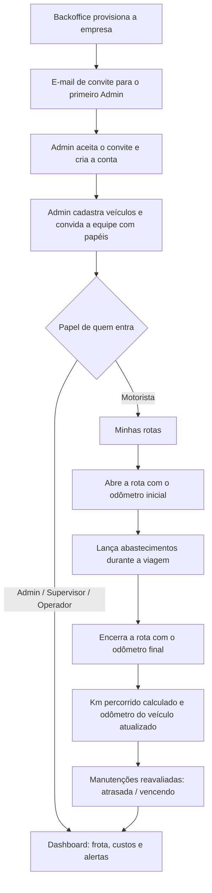
```mermaid
flowchart TD
    A[Backoffice provisiona a empresa] --> B[E-mail de convite para o primeiro Admin]
    B --> C[Admin aceita o convite e cria a conta]
    C --> D[Admin cadastra veículos e convida a equipe com papéis]
    D --> E{Papel de quem entra}
    E -->|Admin / Supervisor / Operador| F[Dashboard: frota, custos e alertas]
    E -->|Motorista| G[Minhas rotas]
    G --> H[Abre a rota com o odômetro inicial]
    H --> I[Lança abastecimentos durante a viagem]
    I --> J[Encerra a rota com o odômetro final]
    J --> K[Km percorrido calculado e odômetro do veículo atualizado]
    K --> L[Manutenções reavaliadas: atrasada / vencendo]
    L --> F
```

Caminho de uma requisição autenticada pela API:

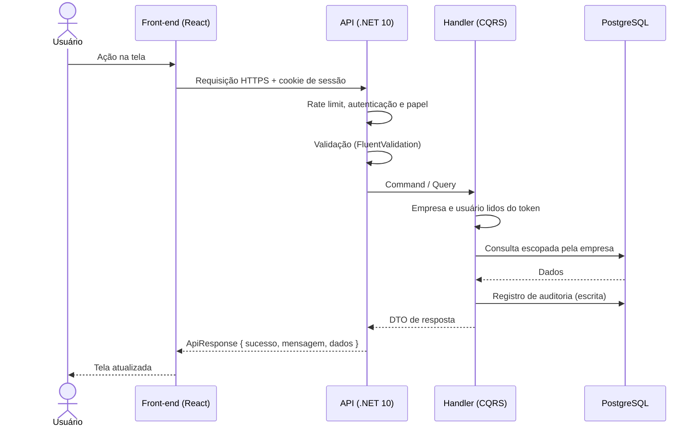
```mermaid
sequenceDiagram
    actor U as Usuário
    participant W as Front-end (React)
    participant A as API (.NET 10)
    participant H as Handler (CQRS)
    participant DB as PostgreSQL

    U->>W: Ação na tela
    W->>A: Requisição HTTPS + cookie de sessão
    A->>A: Rate limit, autenticação e papel
    A->>A: Validação (FluentValidation)
    A->>H: Command / Query
    H->>H: Empresa e usuário lidos do token
    H->>DB: Consulta escopada pela empresa
    DB-->>H: Dados
    H->>DB: Registro de auditoria (escrita)
    H-->>A: DTO de resposta
    A-->>W: ApiResponse { sucesso, mensagem, dados }
    W-->>U: Tela atualizada
```

## **3.2 Ciclo de Vida da Rota e da Manutenção**

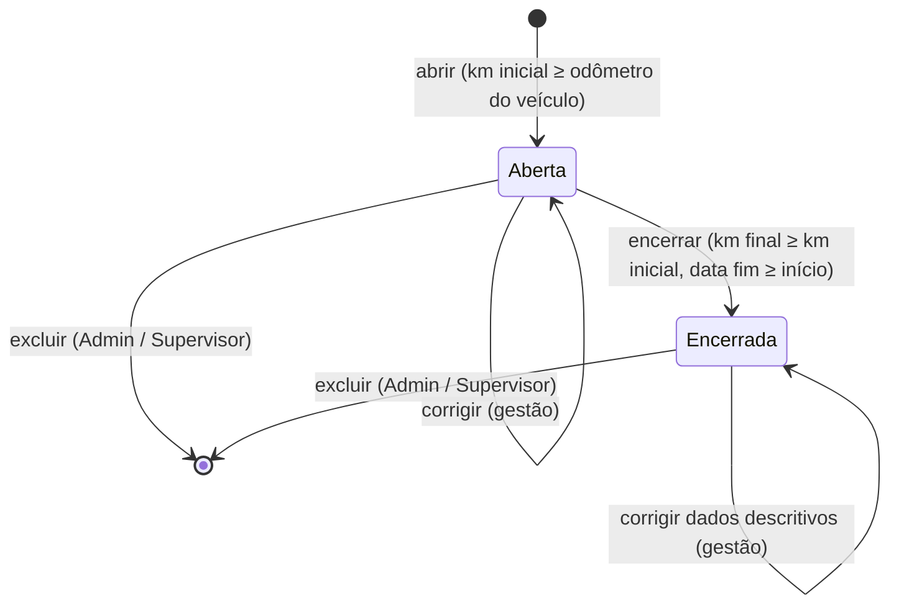
```mermaid
stateDiagram-v2
    [*] --> Aberta: abrir (km inicial ≥ odômetro do veículo)
    Aberta --> Aberta: corrigir (gestão)
    Aberta --> Encerrada: encerrar (km final ≥ km inicial, data fim ≥ início)
    Encerrada --> Encerrada: corrigir dados descritivos (gestão)
    Aberta --> [*]: excluir (Admin / Supervisor)
    Encerrada --> [*]: excluir (Admin / Supervisor)
```

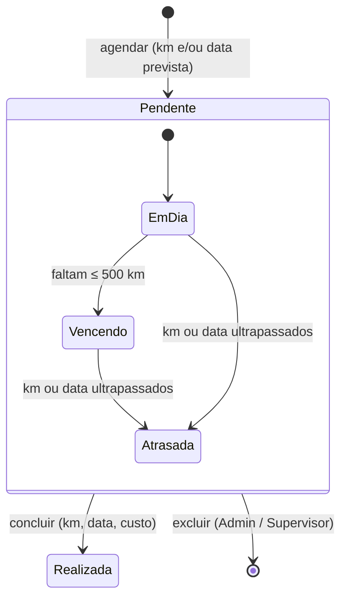
```mermaid
stateDiagram-v2
    [*] --> Pendente: agendar (km e/ou data prevista)
    state Pendente {
        [*] --> EmDia
        EmDia --> Vencendo: faltam ≤ 500 km
        Vencendo --> Atrasada: km ou data ultrapassados
        EmDia --> Atrasada: km ou data ultrapassados
    }
    Pendente --> Realizada: concluir (km, data, custo)
    Pendente --> [*]: excluir (Admin / Supervisor)
```

"Em dia", "vencendo" e "atrasada" não são gravados: são calculados a cada leitura a partir do odômetro atual (RN14).

## **3.3 Fluxos Alternativos**

Tratamento de erros — todas as respostas saem no mesmo envelope:

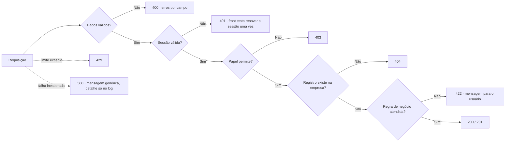
```mermaid
flowchart LR
    R[Requisição] --> V{Dados válidos?}
    V -->|Não| E400[400 · erros por campo]
    V -->|Sim| S{Sessão válida?}
    S -->|Não| E401[401 · front tenta renovar a sessão uma vez]
    S -->|Sim| P{Papel permite?}
    P -->|Não| E403[403]
    P -->|Sim| N{Registro existe na empresa?}
    N -->|Não| E404[404]
    N -->|Sim| RN{Regra de negócio atendida?}
    RN -->|Não| E422[422 · mensagem para o usuário]
    RN -->|Sim| OK[200 / 201]
    R -.limite excedido.-> E429[429]
    R -.falha inesperada.-> E500[500 · mensagem genérica, detalhe só no log]
```

Renovação de sessão quando o token de 1 hora expira:

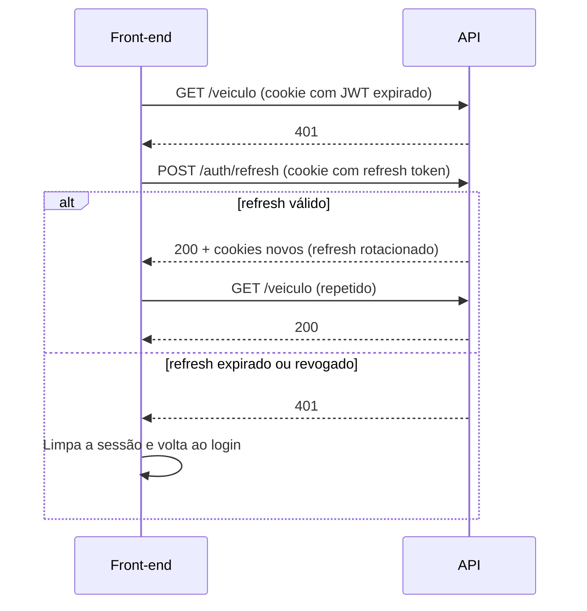
```mermaid
sequenceDiagram
    participant W as Front-end
    participant A as API
    W->>A: GET /veiculo (cookie com JWT expirado)
    A-->>W: 401
    W->>A: POST /auth/refresh (cookie com refresh token)
    alt refresh válido
        A-->>W: 200 + cookies novos (refresh rotacionado)
        W->>A: GET /veiculo (repetido)
        A-->>W: 200
    else refresh expirado ou revogado
        A-->>W: 401
        W->>W: Limpa a sessão e volta ao login
    end
```

Cálculo de trajeto com serviço externo fora do ar:

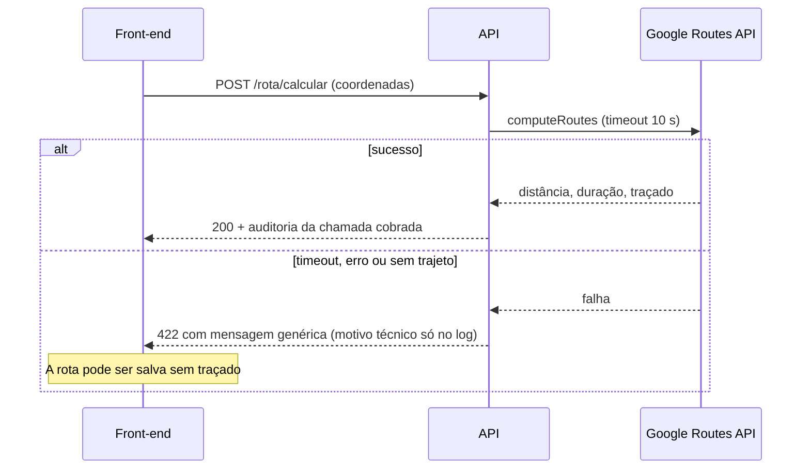
```mermaid
sequenceDiagram
    participant W as Front-end
    participant A as API
    participant G as Google Routes API
    W->>A: POST /rota/calcular (coordenadas)
    A->>G: computeRoutes (timeout 10 s)
    alt sucesso
        G-->>A: distância, duração, traçado
        A-->>W: 200 + auditoria da chamada cobrada
    else timeout, erro ou sem trajeto
        G-->>A: falha
        A-->>W: 422 com mensagem genérica (motivo técnico só no log)
        Note over W: A rota pode ser salva sem traçado
    end
```

---

# **4. Mockups e Experiência do Usuário (UX)**

## **4.1 Fluxo de Navegação**

O protótipo navegável da fase de proposta continua disponível no Figma, como registro histórico:
[Frota360 — UX Mockups](https://www.figma.com/proto/uDTGOVALcjvcTqbxOn1dLe/Frota360-%E2%80%94-UX-Mockups?node-id=0-1&t=nyEFw4FLSve5gYwa-1)

As telas do sistema construído, por papel:

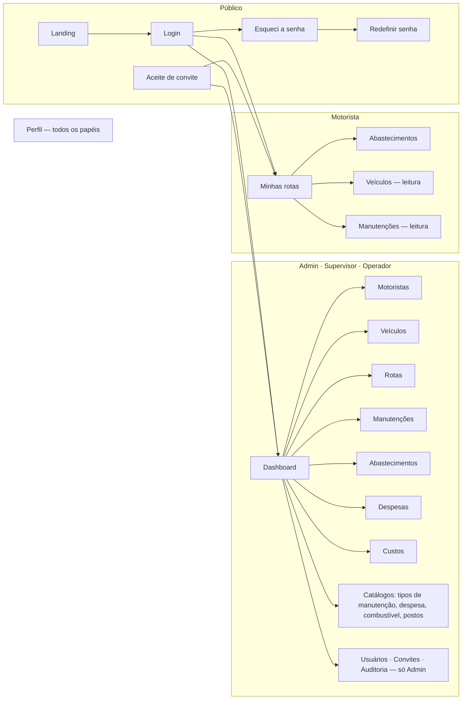
```mermaid
flowchart LR
    subgraph Publico[Público]
        L[Landing] --> LG[Login]
        LG --> ES[Esqueci a senha] --> RS[Redefinir senha]
        CV[Aceite de convite]
    end
    subgraph Gestao[Admin · Supervisor · Operador]
        D[Dashboard] --> MO[Motoristas]
        D --> VE[Veículos]
        D --> RO[Rotas]
        D --> MA[Manutenções]
        D --> AB[Abastecimentos]
        D --> DE[Despesas]
        D --> CU[Custos]
        D --> CAT[Catálogos: tipos de manutenção, despesa, combustível, postos]
        D --> ADM[Usuários · Convites · Auditoria — só Admin]
    end
    subgraph Mot[Motorista]
        MR[Minhas rotas] --> AB2[Abastecimentos]
        MR --> VE2[Veículos — leitura]
        MR --> MA2[Manutenções — leitura]
    end
    LG --> D
    LG --> MR
    CV --> D
    CV --> MR
    PF[Perfil — todos os papéis]
```

## **4.2 Telas do Sistema**

Capturas do sistema em execução, com os dados de desenvolvimento.

**Login** — a entrada é por convite; não há cadastro aberto.

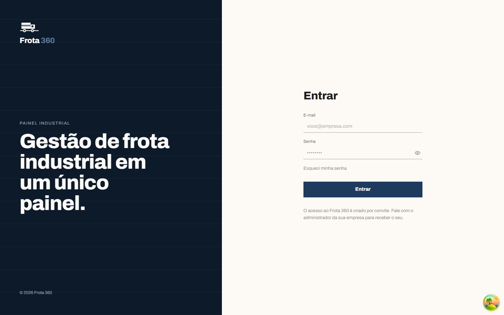

**Dashboard** — frota em rota, custo e km do mês, manutenções atrasadas e rotas em andamento.

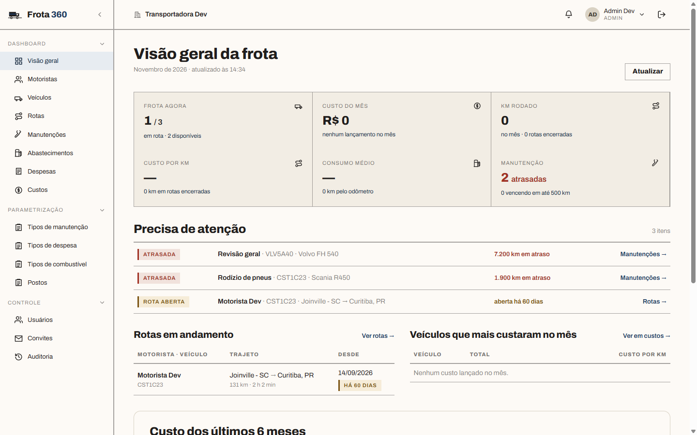

**Rotas** — partida e chegada, odômetro, situação e encerramento.

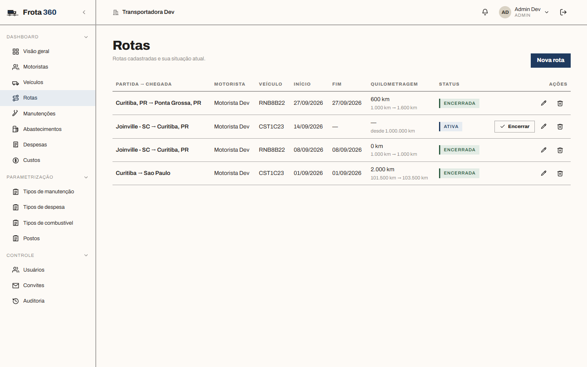

**Manutenções** — pendentes primeiro, com atraso calculado pelo odômetro.

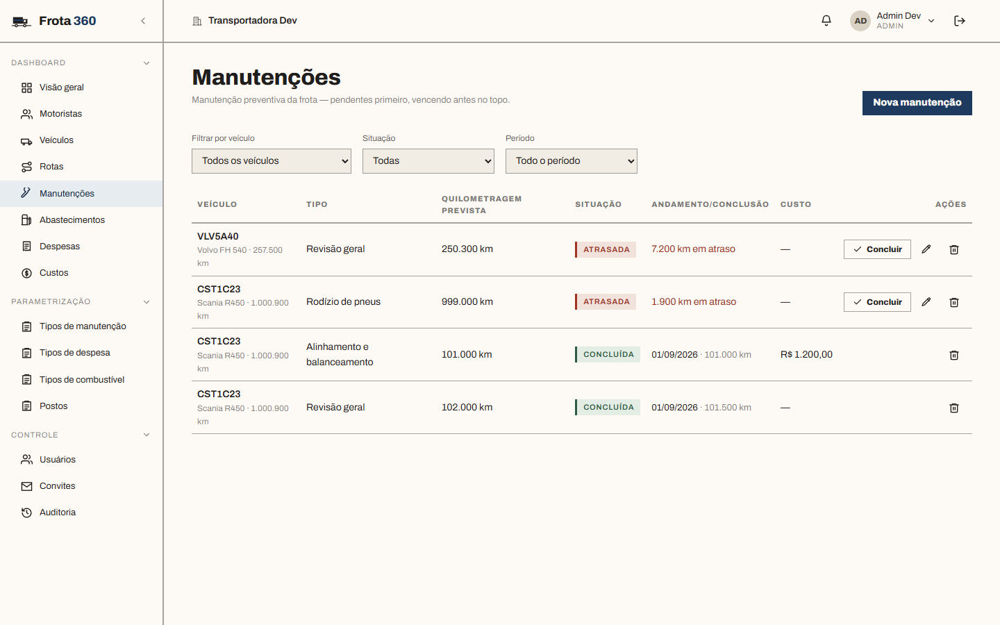

**Abastecimentos** — apontamento fiscal por motorista, posto e combustível.

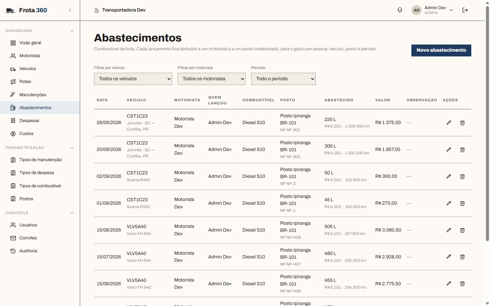

**Custos** — combustível, manutenção e despesas consolidados, com R$/km e km/l por veículo.

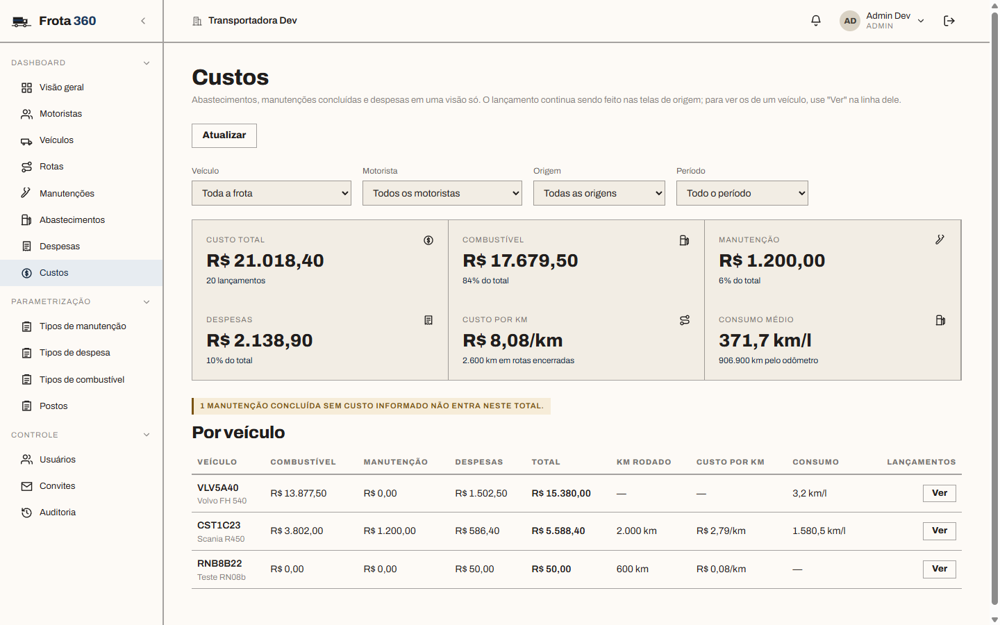

**Auditoria** — trilha somente leitura de tudo o que foi alterado na empresa.

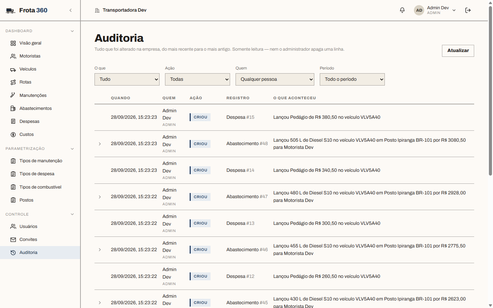

**Minhas rotas (Motorista)** — rota em andamento, lançamento de abastecimento e histórico.

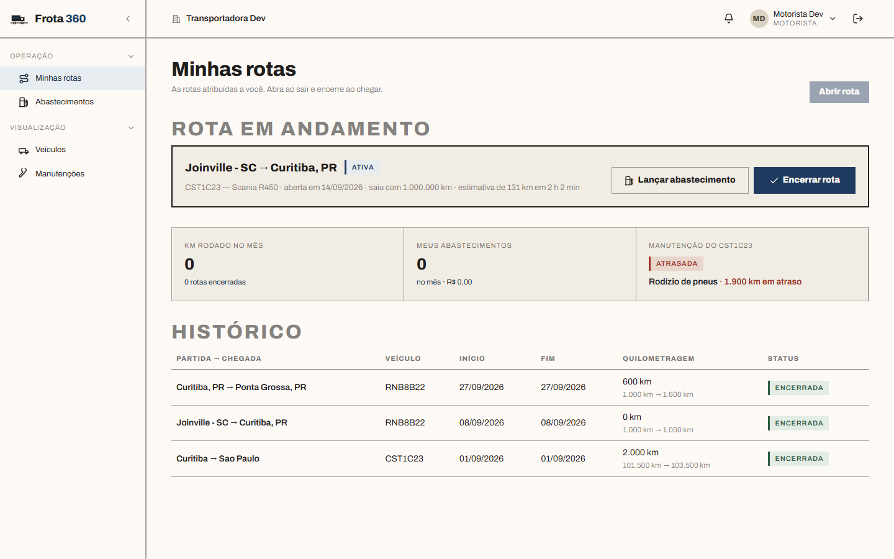

## **4.3 Fluxo de Interação do Usuário — Abrir e encerrar uma rota**

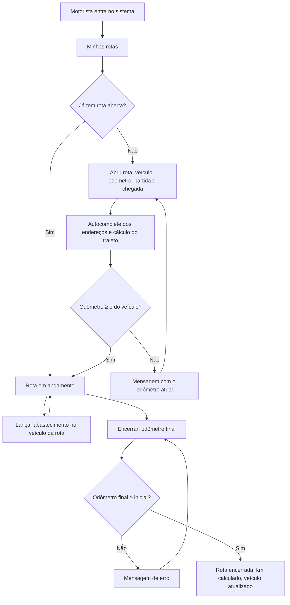
```mermaid
flowchart TD
    A[Motorista entra no sistema] --> B[Minhas rotas]
    B --> C{Já tem rota aberta?}
    C -->|Sim| H[Rota em andamento]
    C -->|Não| D[Abrir rota: veículo, odômetro, partida e chegada]
    D --> E[Autocomplete dos endereços e cálculo do trajeto]
    E --> F{Odômetro ≥ o do veículo?}
    F -->|Não| G[Mensagem com o odômetro atual] --> D
    F -->|Sim| H
    H --> I[Lançar abastecimento no veículo da rota]
    I --> H
    H --> J[Encerrar: odômetro final]
    J --> K{Odômetro final ≥ inicial?}
    K -->|Não| L[Mensagem de erro] --> J
    K -->|Sim| M[Rota encerrada, km calculado, veículo atualizado]
```

---

# **5. Arquitetura do Sistema**

## **5.1 Diagrama C4**

### **Nível 1: Diagrama de Contexto**

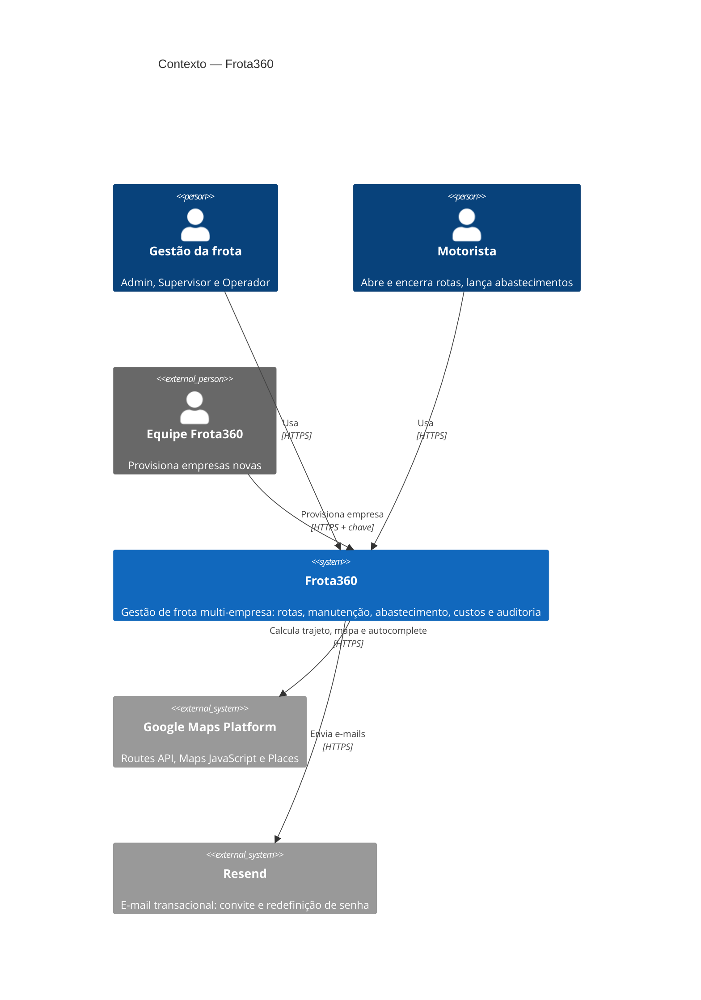
```mermaid
C4Context
    title Contexto — Frota360

    Person(gestao, "Gestão da frota", "Admin, Supervisor e Operador")
    Person(motorista, "Motorista", "Abre e encerra rotas, lança abastecimentos")
    Person_Ext(backoffice, "Equipe Frota360", "Provisiona empresas novas")

    System(frota, "Frota360", "Gestão de frota multi-empresa: rotas, manutenção, abastecimento, custos e auditoria")

    System_Ext(google, "Google Maps Platform", "Routes API, Maps JavaScript e Places")
    System_Ext(resend, "Resend", "E-mail transacional: convite e redefinição de senha")

    Rel(gestao, frota, "Usa", "HTTPS")
    Rel(motorista, frota, "Usa", "HTTPS")
    Rel(backoffice, frota, "Provisiona empresa", "HTTPS + chave")
    Rel(frota, google, "Calcula trajeto, mapa e autocomplete", "HTTPS")
    Rel(frota, resend, "Envia e-mails", "HTTPS")

    UpdateRelStyle(frota, google, $offsetX="-60", $offsetY="-40")
```

### **Nível 2: Diagrama de Containers**

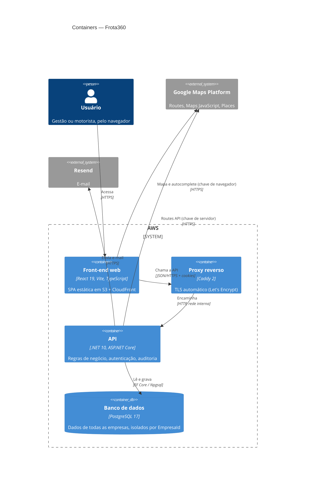
```mermaid
C4Container
    title Containers — Frota360

    Person(usuario, "Usuário", "Gestão ou motorista, pelo navegador")

    System_Boundary(aws, "AWS") {
        Container(spa, "Front-end web", "React 19, Vite, TypeScript", "SPA estática em S3 + CloudFront")
        Container(caddy, "Proxy reverso", "Caddy 2", "TLS automático (Let's Encrypt)")
        Container(api, "API", ".NET 10, ASP.NET Core", "Regras de negócio, autenticação, auditoria")
        ContainerDb(db, "Banco de dados", "PostgreSQL 17", "Dados de todas as empresas, isolados por EmpresaId")
    }

    System_Ext(google, "Google Maps Platform", "Routes, Maps JavaScript, Places")
    System_Ext(resend, "Resend", "E-mail")

    Rel(usuario, spa, "Acessa", "HTTPS")
    Rel(spa, caddy, "Chama a API", "JSON/HTTPS + cookies")
    Rel(caddy, api, "Encaminha", "HTTP, rede interna")
    Rel(api, db, "Lê e grava", "EF Core / Npgsql")
    Rel(api, google, "Routes API (chave de servidor)", "HTTPS")
    Rel(spa, google, "Mapa e autocomplete (chave de navegador)", "HTTPS")
    Rel(api, resend, "Envia e-mail", "HTTPS")

    UpdateRelStyle(spa, caddy, $offsetY="-40")
    UpdateRelStyle(caddy, api, $offsetY="-40")
```

API, banco e proxy rodam numa EC2 única com Docker Compose; só as portas 80 e 443 ficam expostas. O DNS é gerenciado no Cloudflare.

### **Nível 3: Diagrama de Componentes (API)**

Neste nível o diagrama usa a notação de fluxograma, com as cores do C4 (azul para componentes, cinza para o que é externo à API), porque o layout automático do C4 no Mermaid cruza as relações e prejudica a leitura.

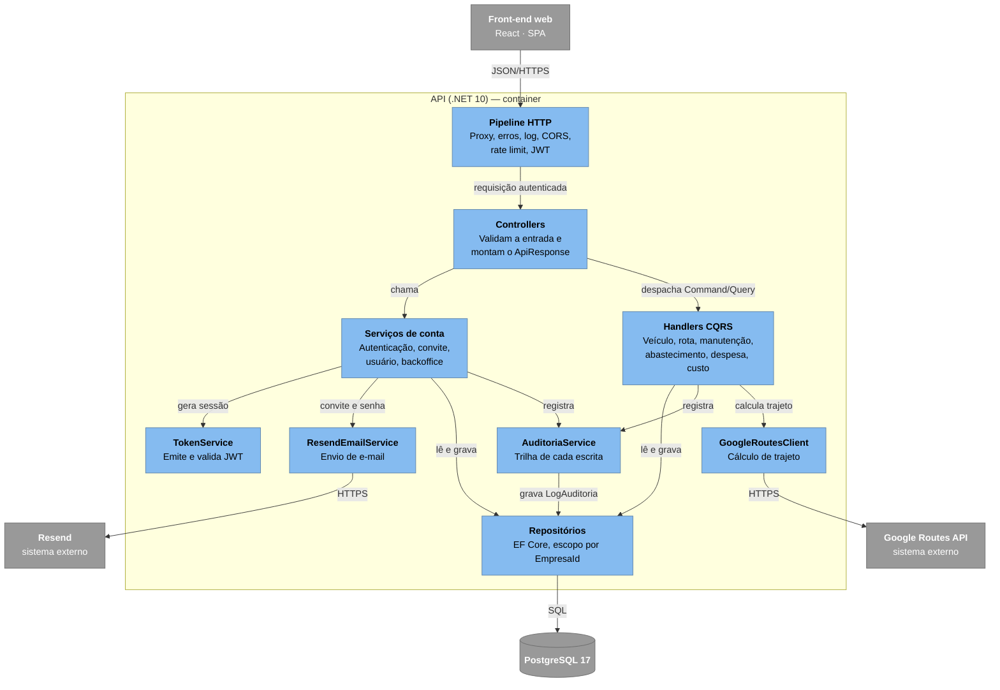
```mermaid
flowchart TB
    spa["<b>Front-end web</b><br/>React · SPA"]:::ext
    subgraph api["API (.NET 10) — container"]
        direction TB
        mw["<b>Pipeline HTTP</b><br/>Proxy, erros, log, CORS,<br/>rate limit, JWT"]
        ctrl["<b>Controllers</b><br/>Validam a entrada e<br/>montam o ApiResponse"]
        svc["<b>Serviços de conta</b><br/>Autenticação, convite,<br/>usuário, backoffice"]
        cqrs["<b>Handlers CQRS</b><br/>Veículo, rota, manutenção,<br/>abastecimento, despesa, custo"]
        aud["<b>AuditoriaService</b><br/>Trilha de cada escrita"]
        token["<b>TokenService</b><br/>Emite e valida JWT"]
        repo["<b>Repositórios</b><br/>EF Core, escopo por EmpresaId"]
        email["<b>ResendEmailService</b><br/>Envio de e-mail"]
        rotas["<b>GoogleRoutesClient</b><br/>Cálculo de trajeto"]
    end
    db[("<b>PostgreSQL 17</b>")]:::ext
    resend["<b>Resend</b><br/>sistema externo"]:::ext
    google["<b>Google Routes API</b><br/>sistema externo"]:::ext

    spa -->|JSON/HTTPS| mw
    mw -->|requisição autenticada| ctrl
    ctrl -->|chama| svc
    ctrl -->|despacha Command/Query| cqrs
    svc -->|gera sessão| token
    svc -->|convite e senha| email
    svc -->|lê e grava| repo
    svc -->|registra| aud
    cqrs -->|lê e grava| repo
    cqrs -->|registra| aud
    cqrs -->|calcula trajeto| rotas
    aud -->|grava LogAuditoria| repo
    repo -->|SQL| db
    email -->|HTTPS| resend
    rotas -->|HTTPS| google

    classDef default fill:#85bbf0,stroke:#5d82a8,color:#000
    classDef ext fill:#999999,stroke:#6b6b6b,color:#fff
```

## **5.2 Modelo de Dados**

### **5.2.1 Diagrama Entidade-Relacionamento**

Toda entidade de negócio carrega `EmpresaId` (omitido nas relações abaixo, exceto em `EMPRESA`, para legibilidade).

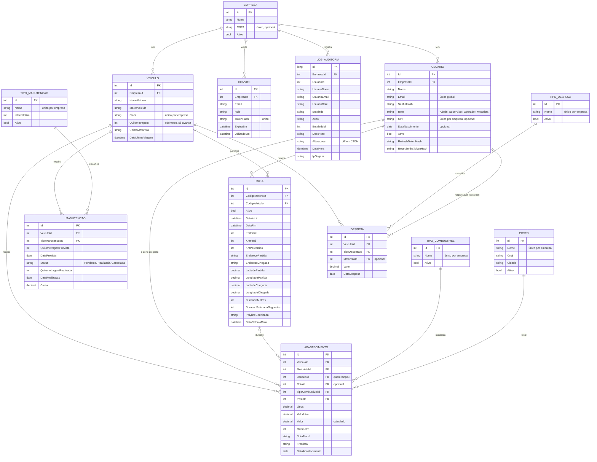
```mermaid
erDiagram
    EMPRESA ||--o{ USUARIO : "tem"
    EMPRESA ||--o{ VEICULO : "tem"
    EMPRESA ||--o{ CONVITE : "emite"
    EMPRESA ||--o{ LOG_AUDITORIA : "registra"
    USUARIO ||--o{ ROTA : "dirige (motorista)"
    VEICULO ||--o{ ROTA : "percorre"
    VEICULO ||--o{ MANUTENCAO : "recebe"
    TIPO_MANUTENCAO ||--o{ MANUTENCAO : "classifica"
    VEICULO ||--o{ ABASTECIMENTO : "recebe"
    USUARIO ||--o{ ABASTECIMENTO : "é dono do gasto"
    ROTA |o--o{ ABASTECIMENTO : "durante"
    TIPO_COMBUSTIVEL ||--o{ ABASTECIMENTO : "classifica"
    POSTO ||--o{ ABASTECIMENTO : "local"
    VEICULO ||--o{ DESPESA : "recebe"
    TIPO_DESPESA ||--o{ DESPESA : "classifica"
    USUARIO |o--o{ DESPESA : "responsável (opcional)"

    EMPRESA {
        int Id PK
        string Nome
        string CNPJ "único, opcional"
        bool Ativo
    }
    USUARIO {
        int Id PK
        int EmpresaId FK
        string Nome
        string Email "único global"
        string SenhaHash
        string Role "Admin, Supervisor, Operador, Motorista"
        string CPF "único por empresa, opcional"
        date DataNascimento "opcional"
        bool Ativo
        string RefreshTokenHash
        string ResetSenhaTokenHash
    }
    CONVITE {
        int Id PK
        int EmpresaId FK
        string Email
        string Role
        string TokenHash "único"
        datetime ExpiraEm
        datetime UtilizadoEm
    }
    VEICULO {
        int Id PK
        int EmpresaId FK
        string NomeVeiculo
        string MarcaVeiculo
        string Placa "única por empresa"
        int Quilometragem "odômetro, só avança"
        string UltimoMotorista
        datetime DataUltimaViagem
    }
    ROTA {
        int Id PK
        int CodigoMotorista FK
        int CodigoVeiculo FK
        bool Ativo
        datetime DataInicio
        datetime DataFim
        int KmInicial
        int KmFinal
        int KmPercorrido
        string EnderecoPartida
        string EnderecoChegada
        decimal LatitudePartida
        decimal LongitudePartida
        decimal LatitudeChegada
        decimal LongitudeChegada
        int DistanciaMetros
        int DuracaoEstimadaSegundos
        string PolylineCodificada
        datetime DataCalculoRota
    }
    TIPO_MANUTENCAO {
        int Id PK
        string Nome "único por empresa"
        int IntervaloKm
        bool Ativo
    }
    MANUTENCAO {
        int Id PK
        int VeiculoId FK
        int TipoManutencaoId FK
        int QuilometragemPrevista
        date DataPrevista
        string Status "Pendente, Realizada, Cancelada"
        int QuilometragemRealizada
        date DataRealizacao
        decimal Custo
    }
    ABASTECIMENTO {
        int Id PK
        int VeiculoId FK
        int MotoristaId FK
        int UsuarioId FK "quem lançou"
        int RotaId FK "opcional"
        int TipoCombustivelId FK
        int PostoId FK
        decimal Litros
        decimal ValorLitro
        decimal Valor "calculado"
        int Odometro
        string NotaFiscal
        string Frentista
        date DataAbastecimento
    }
    TIPO_COMBUSTIVEL {
        int Id PK
        string Nome "único por empresa"
        bool Ativo
    }
    POSTO {
        int Id PK
        string Nome "único por empresa"
        string Cnpj
        string Cidade
        bool Ativo
    }
    DESPESA {
        int Id PK
        int VeiculoId FK
        int TipoDespesaId FK
        int MotoristaId FK "opcional"
        decimal Valor
        date DataDespesa
    }
    TIPO_DESPESA {
        int Id PK
        string Nome "único por empresa"
        bool Ativo
    }
    LOG_AUDITORIA {
        long Id PK
        int EmpresaId FK
        int UsuarioId
        string UsuarioNome
        string UsuarioEmail
        string UsuarioRole
        string Entidade
        string Acao
        int EntidadeId
        string Descricao
        string Alteracoes "diff em JSON"
        datetime DataHora
        string IpOrigem
    }
```

### **5.2.2 Esquema Relacional — restrições que o banco garante**

| Tabela | Restrição | Regra |
| :---- | :---- | :---- |
| `Usuario` | Índice único em `Email` | RN04 |
| `Usuario` | Índice único em `(EmpresaId, CPF)`, filtrado por `CPF IS NOT NULL` | RN03 |
| `Veiculo` | Índice único em `(EmpresaId, Placa)` | RN02 |
| `Empresa` | Índice único em `CNPJ`, filtrado por `CNPJ IS NOT NULL` | — |
| `Convite` | Índice único em `TokenHash` | RN20 |
| `TipoManutencao`, `TipoDespesa`, `TipoCombustivel`, `Posto` | Índice único em `(EmpresaId, Nome)` | Catálogo sem nomes repetidos |
| `Rota`, `Abastecimento`, `Despesa`, `Manutencao` | Chaves estrangeiras `Restrict` para veículo e usuário | RN08 — histórico não some em cascata |
| `Abastecimento.RotaId` | Chave estrangeira `SetNull` | Excluir a rota não apaga o gasto |
| `LogAuditoria` | Índices `(EmpresaId, DataHora)`, `(EmpresaId, Entidade, EntidadeId)`, `(EmpresaId, UsuarioId, DataHora)` | Consultas da tela de auditoria |

Valores monetários usam `numeric(10,2)`; coordenadas, `numeric(9,6)`; datas, `timestamp without time zone` em hora de Brasília. O schema é versionado por migrations do EF Core.

### **5.2.3 Modelo de Documentos (NoSQL)**

Não se aplica: todo o armazenamento é relacional.

---

## **5.3 Principais Componentes**

* **Frota360.Api** (apresentação e entrada): controllers REST versionados (`/api/v1`), pipeline de middlewares (cabeçalhos do proxy, tratamento de exceções, log estruturado, CORS, rate limit, autenticação), leitura da sessão a partir do cookie e montagem do envelope `ApiResponse`.
* **Frota360.Application** (casos de uso): CQRS manual com um dispatcher próprio — comandos, consultas e seus handlers por agregado —, serviços de conta (autenticação, convite, usuário, backoffice), validação com FluentValidation, DTOs e mapeamentos manuais. É aqui que vivem as regras de negócio e o registro de auditoria.
* **Frota360.Domain** (núcleo): entidades (`Empresa`, `Usuario`, `Convite`, `Veiculo`, `Rota`, `TipoManutencao`, `Manutencao`, `Abastecimento`, `TipoCombustivel`, `Posto`, `Despesa`, `TipoDespesa`, `LogAuditoria`), enums, constantes de papéis e de auditoria e as interfaces de repositório. Sem dependência de pacote externo.
* **Frota360.Infrastructure** (persistência e integrações): `DbContext` do EF Core sobre PostgreSQL, repositórios, migrations, emissão de JWT, envio de e-mail pelo Resend e cliente da Google Routes API.
* **Front-end web** (`apps/web`): SPA em React com rotas protegidas por papel, cache de dados com TanStack Query, sessão por cookie e um design system próprio.
* **Autenticação e segurança** (transversal): BCrypt para senhas, JWT de 1 hora e refresh token de 7 dias em cookies `HttpOnly`, papéis por ação nos controllers e isolamento por empresa em todo acesso a dados.

## **5.4 Stack Tecnológica**

### Backend

* **.NET 10 / ASP.NET Core** — versão mais recente da plataforma, com alto desempenho, injeção de dependência nativa e suporte direto a APIs REST.
* **PostgreSQL 17** — banco relacional de código aberto, sem custo de licença e com imagem que roda em ARM (Graviton). Substituiu o SQL Server da v1: o Express tem teto de 10 GB, exige 2 GB de RAM e não roda em arm64.
* **Entity Framework Core + Npgsql** — ORM com consultas parametrizadas e migrations que versionam o schema junto com o código, aplicadas automaticamente no boot em produção.
* **FluentValidation** — validação de entrada fortemente tipada, isolada das regras de negócio.
* **BCrypt.Net-Next** — hash de senha lento por design, dificultando força bruta.
* **JWT Bearer** — autenticação sem estado, com o token lido de cookie `HttpOnly`.
* **Serilog** — log estruturado; em produção, no console do container, com rotação feita pelo Docker.
* **Asp.Versioning** — versionamento da API por URL (`/api/v1`).
* **Scalar** — documentação interativa OpenAPI, disponível em desenvolvimento.

### Frontend

* **React 19 + TypeScript** — interface baseada em componentes, com tipagem estática.
* **Vite** — build e servidor de desenvolvimento rápidos.
* **TanStack Query** — cache e sincronização dos dados da API, com invalidação por chave.
* **React Router** — rotas da SPA e guardas por papel.
* **Tailwind CSS** — estilos utilitários sobre um design system próprio.
* **Google Maps JavaScript API + Places** (`@vis.gl/react-google-maps`) — mapa do trajeto e autocomplete de endereço.

### Integrações

* **Google Routes API** — distância, duração e traçado da rota, com máscara de campos mínima para manter o custo por chamada baixo.
* **Resend** — envio de e-mail transacional (convite e redefinição de senha).

### Qualidade

* **xUnit + NSubstitute + Testcontainers** — testes unitários, da camada HTTP e de integração contra um PostgreSQL real.
* **Vitest + Testing Library + MSW** — testes do front-end, com as chamadas HTTP interceptadas.
* **SonarCloud** — análise estática de código e segurança, com quality gate nos PRs.
* **GitHub Actions** — CI com build, testes, cobertura mínima e verificação da imagem Docker.

### Infraestrutura

* **Docker + Docker Compose** — a mesma stack (API, PostgreSQL, Caddy) em desenvolvimento, ensaio e produção.
* **Caddy** — proxy reverso com certificado TLS automático, no lugar de um load balancer pago.
* **AWS EC2** (API e banco) e **S3 + CloudFront** (front-end estático), com DNS no **Cloudflare**.

# **6. Segurança e Privacidade**

## **6.1 Proteção contra OWASP Top 10**

| Risco | Mitigação Aplicada |
| :---- | :---- |
| A01 – Broken Access Control | Todo endpoint de negócio exige sessão; papéis verificados por ação (`[Authorize(Roles = ...)]`); `EmpresaId` sempre lido do token e aplicado em toda consulta; registro de outra empresa ou de outro motorista responde como inexistente (404) |
| A02 – Cryptographic Failures | Senhas com BCrypt; tokens de convite, redefinição e refresh guardados só como hash; JWT assinado com HMAC-SHA256 e chave de no mínimo 32 caracteres; TLS em todo o tráfego externo |
| A03 – Injection | Acesso ao banco via EF Core com consultas parametrizadas; nenhum SQL montado por concatenação |
| A04 – Insecure Design | Clean Architecture; valores derivados (valor do abastecimento, km percorrido, situação da manutenção) calculados no servidor, nunca aceitos do cliente; trava de plausibilidade para o traçado vindo do cliente (RN19) |
| A05 – Security Misconfiguration | Segredos só por variável de ambiente; a aplicação não inicia sem a configuração obrigatória de produção; Scalar e OpenAPI desligados fora de desenvolvimento; apenas as portas 80 e 443 expostas |
| A06 – Vulnerable Components | Dependências via NuGet e npm; análise do SonarCloud em todo PR; `npm ci --ignore-scripts` no CI |
| A07 – Identification and Authentication Failures | Rate limit de 5 req/min por IP nas rotas de autenticação e convite; JWT de 1 hora com `jti` único; refresh token rotacionado e revogado no logout, na redefinição de senha, na troca de papel e na desativação |
| A08 – Software and Data Integrity Failures | Build reproduzível via Dockerfile multi-stage com imagem base oficial da Microsoft; container roda com usuário sem privilégio |
| A09 – Security Logging and Monitoring Failures | Serilog com log estruturado de requisições e erros; trilha de auditoria de toda escrita, com autor e IP de origem; monitoramento externo planejado (seção 7) |
| A10 – Server-Side Request Forgery | A API só chama hosts fixos (Google Routes e Resend); nenhuma URL vem do usuário — o cálculo de trajeto recebe apenas coordenadas numéricas validadas por faixa |

## **6.2 Autenticação e Autorização**

* Login com BCrypt; a sessão é um JWT de 1 hora mais um refresh token de 7 dias, rotacionado a cada renovação.
* Os dois tokens vão em cookies `HttpOnly; Secure; SameSite=None` — o JavaScript do front nunca os lê, o que protege contra roubo por XSS.
* O JWT é validado em emissor, audiência, validade e assinatura, e carrega `sub`, `email`, `name`, `jti`, `empresaId` e `role`.
* A autorização é por papel em cada ação dos controllers; o front esconde as ações que o papel não permite, mas quem decide é o servidor.
* Não há cadastro aberto: a conta nasce de um convite com validade de 7 dias e uso único.
* Redefinição de senha responde sempre da mesma forma, sem revelar se o e-mail existe, e derruba as sessões abertas.

## **6.3 Criptografia e Dados em Trânsito**

* HTTPS obrigatório: em produção o TLS é terminado pelo Caddy, com certificado automático do Let's Encrypt; em desenvolvimento, pelo próprio Kestrel.
* API e banco se comunicam pela rede interna do Docker Compose; o banco não tem porta exposta.
* O proxy só é aceito como origem dos cabeçalhos `X-Forwarded-*` dentro da sub-rede do Compose, o que impede forjar o IP de origem gravado na auditoria.

## **6.4 Tratamento de Erros**

* O `ExceptionMiddleware` intercepta toda exceção não tratada e devolve o envelope `ApiResponse` padronizado, sem stack trace nem detalhe de infraestrutura.
* Violação de regra de negócio vira **422** com mensagem escrita para o usuário final; falha de serviço externo vira 422 com texto genérico, e o motivo técnico fica só no log.

## **6.5 Privacidade e LGPD**

### **Dados coletados**

| Onde | Dados pessoais |
| :---- | :---- |
| Usuário (gestão e motoristas) | Nome, e-mail, senha (hash), papel, CPF (opcional), data de nascimento (opcional) |
| Convite | E-mail do convidado |
| Trilha de auditoria | Nome, e-mail, papel e IP de origem de quem executou a ação |
| Rotas | Endereços e coordenadas de partida e chegada, vinculados ao motorista |
| Abastecimentos e despesas | Vínculo do gasto ao motorista; nome do frentista (opcional) |

Dados operacionais como veículos e quilometragem não são dados pessoais, mas rotas, abastecimentos e despesas estão associados a motoristas identificáveis.

### **Finalidade e base legal**

Os dados são tratados exclusivamente para a operação da gestão de frota. A base legal é o legítimo interesse do controlador — a empresa que opera a frota — para a execução de suas atividades (Art. 7º, IX). O Frota360 atua como operador em nome de cada empresa cliente.

### **Compartilhamento e transferência internacional**

| Operador | Dados enviados | Finalidade |
| :---- | :---- | :---- |
| Google (Maps Platform) | Endereços e coordenadas de partida e chegada das rotas | Autocomplete, mapa e cálculo de trajeto |
| Resend | E-mail do destinatário e o link do convite ou da redefinição | Envio de e-mail transacional |
| AWS | Todos os dados, armazenados na região de São Paulo (sa-east-1) | Hospedagem |

Google e Resend processam dados fora do Brasil, o que caracteriza **transferência internacional** (Art. 33). Ela se apoia nos termos de proteção de dados desses fornecedores e é limitada ao mínimo necessário: nenhum dos dois recebe CPF, data de nascimento ou dados financeiros.

### **Armazenamento e retenção**

* Banco PostgreSQL na AWS (sa-east-1), sem porta exposta, com acesso apenas pela API autenticada.
* Senhas e tokens guardados apenas como hash, sem possibilidade de reversão.
* Trilha de auditoria: retenção de 12 meses, justificada pelo ciclo anual de auditoria e pelo princípio da necessidade (Art. 6º, III). A rotina de expurgo ainda não está implementada.
* Logs da aplicação: rotação pelo Docker, até 5 arquivos de 10 MB por container.

### **Direitos do titular**

Em conformidade com os Arts. 17 a 22 da LGPD, o titular (usuário ou motorista) pode solicitar:

| Direito | Como exercer |
| :---- | :---- |
| Acesso | Pela tela **Perfil** (`GET /usuario/perfil`), disponível a todos os papéis, ou por solicitação ao Admin da empresa |
| Correção | Pela tela **Perfil** (`PUT /usuario/perfil`): o próprio titular corrige nome, CPF e data de nascimento. O e-mail não é editável por ser a chave de login; a correção é feita por solicitação ao controlador |
| Eliminação | Usuários não são excluídos, para não romper o histórico de rotas e gastos (RN08); a conta é desativada, e a anonimização dos dados pessoais é feita sob solicitação formal ao controlador |
| Portabilidade | Solicitação ao controlador; os dados podem ser exportados em JSON pela API |
| Revogação de consentimento | Solicitação formal ao controlador; o tratamento se apoia em legítimo interesse, não em consentimento |

# **7. Planejamento do Projeto**

Início das atividades: 28/04/2026. Entrega: 30/11/2026.

## **7.1 Marcos de Desenvolvimento**

O plano da v1 previa seis marcos até 01/09/2026, com deploy em App Runner + RDS + ElastiCache. A ampliação de escopo da seção 2.7 deslocou a entrega para 30/11/2026. O que foi realizado:

| Marco | Descrição | Período | Situação |
| :---- | :---- | :---- | :---- |
| M1 | API inicial: autenticação JWT, Docker, endpoints de veículo, motorista e rota | 28/04 – 06/05 | ✅ |
| M2 | CQRS e primeiros testes unitários | 16/06 | ✅ |
| M3 | Refresh token, migrations, CORS e front-end inicial | 18/08 – 21/08 | ✅ |
| M4 | Papéis, multi-tenant, convite por e-mail e landing page | 21/08 – 25/08 | ✅ |
| M5 | Manutenção preventiva e monorepo (API + front) | 25/08 – 27/08 | ✅ |
| M6 | PostgreSQL, ciclo de odômetro da rota, auditoria, custos e despesas | 28/08 – 01/09 | ✅ |
| M7 | Abastecimento fiscal, paginação no servidor, Google Routes e dashboard de triagem | 03/09 – 28/09 | ✅ |
| M8 | Testes do front (93%) e do back (82%), SonarCloud com quality gate | 12/11 – 13/11 | ✅ |
| M9 | Wiki, monitoramento, deploy em produção, pipeline de CD e release v1.0.0 | 14/11 – 30/11 | Em andamento |

# **8. Referências**

### **Documentação Técnica Oficial**

* Microsoft. .NET 10 Documentation. Disponível em: [https://learn.microsoft.com/dotnet](https://learn.microsoft.com/dotnet)
* Microsoft. ASP.NET Core — Web API. Disponível em: [https://learn.microsoft.com/aspnet/core](https://learn.microsoft.com/aspnet/core)
* Microsoft. Entity Framework Core. Disponível em: [https://learn.microsoft.com/ef/core](https://learn.microsoft.com/ef/core)
* Microsoft. ASP.NET Core Rate Limiting. Disponível em: [https://learn.microsoft.com/aspnet/core/performance/rate-limit](https://learn.microsoft.com/aspnet/core/performance/rate-limit)
* PostgreSQL Global Development Group. PostgreSQL 17 Documentation. Disponível em: [https://www.postgresql.org/docs/17/](https://www.postgresql.org/docs/17/)
* Npgsql. Entity Framework Core Provider. Disponível em: [https://www.npgsql.org/efcore/](https://www.npgsql.org/efcore/)
* React. Documentação oficial. Disponível em: [https://react.dev](https://react.dev)
* TanStack. TanStack Query. Disponível em: [https://tanstack.com/query](https://tanstack.com/query)
* Google. Routes API. Disponível em: [https://developers.google.com/maps/documentation/routes](https://developers.google.com/maps/documentation/routes)
* Resend. Documentação. Disponível em: [https://resend.com/docs](https://resend.com/docs)
* Caddy. Automatic HTTPS. Disponível em: [https://caddyserver.com/docs/automatic-https](https://caddyserver.com/docs/automatic-https)

### **Segurança**

* OWASP. OWASP Top Ten. Disponível em: [https://owasp.org/www-project-top-ten](https://owasp.org/www-project-top-ten)
* Microsoft. JWT Bearer Authentication in ASP.NET Core. Disponível em: [https://learn.microsoft.com/aspnet/core/security/authentication/jwt-authn](https://learn.microsoft.com/aspnet/core/security/authentication/jwt-authn)
* bcrypt.net. BCrypt.Net-Next. Disponível em: [https://github.com/BcryptNet/bcrypt.net](https://github.com/BcryptNet/bcrypt.net)

### **Arquitetura e Padrões**

* Martin, Robert C. Clean Architecture: A Craftsman's Guide to Software Structure and Design. Prentice Hall, 2017.
* Fowler, Martin. CQRS Pattern. Disponível em: [https://martinfowler.com/bliki/CQRS.html](https://martinfowler.com/bliki/CQRS.html)
* Microsoft. CQRS Pattern — Azure Architecture Center. Disponível em: [https://learn.microsoft.com/azure/architecture/patterns/cqrs](https://learn.microsoft.com/azure/architecture/patterns/cqrs)
* Microsoft. Repository Pattern. Disponível em: [https://learn.microsoft.com/dotnet/architecture/microservices/microservice-ddd-cqrs-patterns/infrastructure-persistence-layer-design](https://learn.microsoft.com/dotnet/architecture/microservices/microservice-ddd-cqrs-patterns/infrastructure-persistence-layer-design)
* Brown, Simon. The C4 model for visualising software architecture. Disponível em: [https://c4model.com](https://c4model.com)

### **Legislação e Privacidade**

* Brasil. Lei nº 13.709, de 14 de agosto de 2018 — Lei Geral de Proteção de Dados Pessoais (LGPD). Disponível em: [https://www.planalto.gov.br/ccivil_03/_ato2015-2018/2018/lei/l13709.htm](https://www.planalto.gov.br/ccivil_03/_ato2015-2018/2018/lei/l13709.htm)
* ANPD. Guia Orientativo para Definições dos Agentes de Tratamento de Dados Pessoais. Disponível em: [https://www.gov.br/anpd](https://www.gov.br/anpd)

### **Ferramentas Utilizadas**

| Ferramenta | Finalidade | Link |
| :---- | :---- | :---- |
| Visual Studio Code | Editor de código | [https://code.visualstudio.com](https://code.visualstudio.com) |
| Docker Desktop | Containers em desenvolvimento | [https://www.docker.com](https://www.docker.com) |
| PostgreSQL 17 | Banco de dados | [https://www.postgresql.org](https://www.postgresql.org) |
| Scalar | Documentação e teste dos endpoints | [https://scalar.com](https://scalar.com) |
| xUnit, NSubstitute, Testcontainers | Testes do backend | [https://xunit.net](https://xunit.net) |
| Vitest, Testing Library, MSW | Testes do frontend | [https://vitest.dev](https://vitest.dev) |
| SonarCloud | Análise estática | [https://sonarcloud.io](https://sonarcloud.io) |
| GitHub Actions | Integração contínua | [https://github.com/features/actions](https://github.com/features/actions) |
| Playwright | Verificação visual do front-end | [https://playwright.dev](https://playwright.dev) |
| Figma | Protótipo de UX da fase de proposta | [https://www.figma.com](https://www.figma.com) |
| Claude | Assistente de IA | [https://claude.ai](https://claude.ai) |
